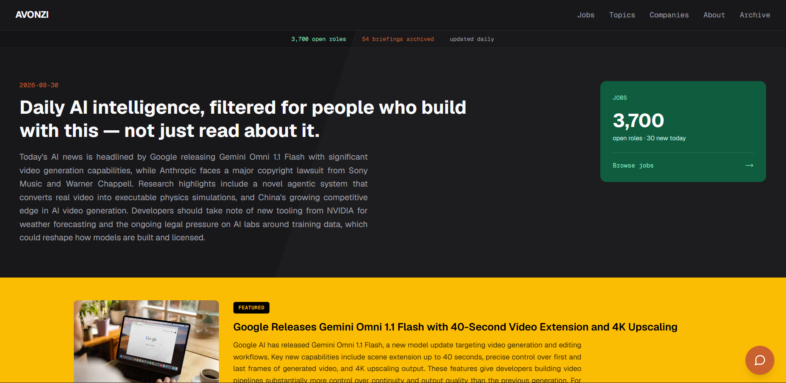
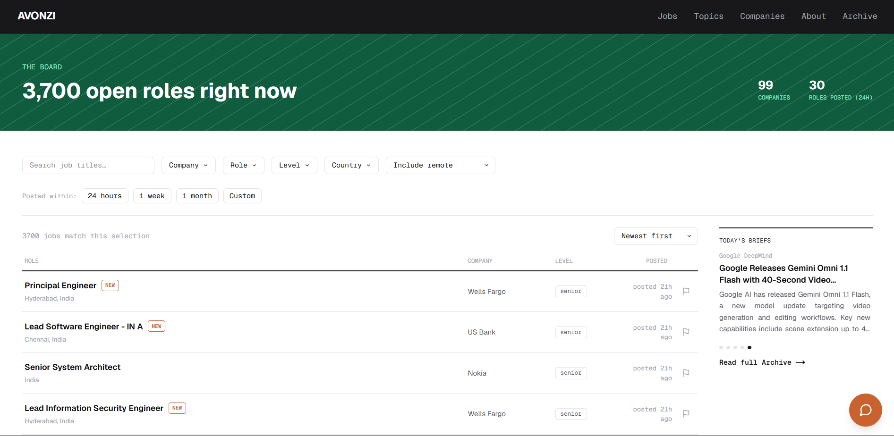

# Avonzi

**AI intelligence and job tracking, delivered daily.**

Avonzi is a full-stack platform built for engineers, researchers, and practitioners who need to stay current on what's actually shipping in AI — model releases, research, tooling, and implementation-level updates — and who are looking for open roles across AI and broader tech companies. Every day, Avonzi compiles an Archive made up of individual Briefs, alongside a continuously updated board of real job openings, not limited to AI-focused companies alone.

🔗 **Live at :** [avonzi.com](https://avonzi.com)

> Source code for this project is maintained in private repositories. This repository exists to document and showcase the product.

---

## What Avonzi does

**Daily Archives** — Every day, Avonzi's pipeline gathers, deduplicates, and compiles the day's most significant AI developments into an Archive entry, made up of individual Briefs with AI-generated summaries and full source attribution. The full history is searchable by date range, so nothing that shipped is ever lost to the feed.

**Jobs Board** — A live, continuously updated board of open roles from 165+ companies, refreshed multiple times daily. Listings are filterable by role, seniority, location, and remote status, with debounced autocomplete search, sorting, and pagination — so the newest opportunities are never buried.

**AI Chat Assistant** — A conversational assistant, powered by Claude and Gemini, that answers questions grounded directly in Avonzi's live jobs and news data rather than general knowledge. It's built with prompt-injection-resistant guardrails to keep answers scoped and accurate, plus per-minute rate limiting and a message cap to control cost and abuse.

**Company & Topic Pages** — Every Brief is organized by the company and topic it concerns, so anyone tracking a specific company's trajectory — or a theme like agent tooling or inference hardware — can follow it directly.

**Community Moderation** — Visitors can flag inaccurate or stale job listings directly from the board, feeding a review workflow that keeps the data trustworthy without requiring manual auditing of every post.

**Internal Admin Portal** — A real operations console, not a CRUD afterthought: pipeline health monitoring, per-run execution history, a live system health summary, content moderation with flag-reason analytics, and role-based access control (owner/admin/read-only) for a small internal team.

---

## By the numbers

- **165+ companies tracked**, pulled from 11+ job sources across 8 ATS platforms (Greenhouse, Ashby, Lever, Workday, SmartRecruiters, Eightfold, SuccessFactors, Oracle Cloud HCM), plus custom scrapers for companies like Amazon, Apple, and Netflix
- **10+ RSS feeds and a news API** feed the daily AI news pipeline, deduplicated with a custom similarity-clustering algorithm
- **2,000+ live tech and AI job listings** maintained at any given time
- **Two fully independent ingestion pipelines** (jobs and news), each authenticated with its own isolated, narrowly-scoped credentials, automated via GitHub Actions on independent schedules (jobs every 6 hours, news daily)
- **Multi-provider LLM failover** (Claude + Gemini) for the chat assistant, cutting inference cost by ~82% with no drop in response quality
- **280+ automated backend tests**
- **Full historical audit trail** — every job listing ever seen is logged as a distinct event, not overwritten, preserving a genuine record of the market over time rather than just a live snapshot

---

## Engineering highlights

- **API integrations, not brittle scrapers.** Most major job sources were integrated by reverse-engineering the platform's actual underlying API rather than parsing rendered HTML — including a custom Playwright-based discovery tool that intercepts network requests and inspects embedded JSON/SSR markers to identify a new site's real data source, cutting onboarding time for new companies.
- **Crash-resilient, incremental ingestion.** Results are posted company-by-company as they're fetched, not batched at the end of a run, so a mid-run failure only loses what was in flight at that exact moment — with retry/backoff logic and a watcher that auto-recovers pipeline state after a crash.
- **Deterministic, rubric-based editorial curation.** Story selection for each day's Archive uses an explicit, auditable multi-axis scoring system — company significance, content type, recency, source credibility — run through the Claude API with idempotency checks to avoid redundant cost, rather than relying on unstructured AI judgment.
- **Self-built data-quality auditing.** A dedicated tool flags listings likely to be false positives and reports freshness/staleness per source, catching filtering bugs before they reach production — including real issues like a Workday field-order assumption that caused duplicate job IDs, and a substring-matching bug that misclassified U.S. locations (like "Indiana") as India.
- **Layered authentication, not one-size-fits-all.** Three separate schemes secure one API: public rate-limited access, JWT role-based admin auth with single-use, hashed refresh-token rotation, and scoped API keys for pipeline writes — each enforced per endpoint.
- **Scoped cache invalidation.** Next.js time-based ISR is combined with a secret-authenticated, on-demand revalidation endpoint, so content edits go live within seconds by invalidating only the affected routes instead of the entire site.
- **Full run-lifecycle observability.** Every pipeline execution is tracked start-to-finish — timing, results, failures, and why — as structured data the admin portal can query and display, not logs that vanish after the fact.
- **Tested where it counts.** 280+ automated tests cover the backend, alongside a unified anomaly-logging system so every subsystem's fallback decisions are auditable from one admin view.

<strong>For the technically curious</strong>

- **Machine identity, not shared secrets.** The news and jobs pipelines authenticate with distinct, narrowly-scoped credentials rather than a single shared key — a compromised or misbehaving credential on one side can never touch the other's data.
- **Two data philosophies, one deliberate design.** The jobs pipeline is append-only, preserving a full historical log of every listing ever seen; the news pipeline treats each day's Archive as a discrete, current-state publication with explicit duplicate suppression. Job postings and news content are genuinely different kinds of data with different lifecycle needs, and the system is designed to treat them accordingly rather than forcing one pattern onto both.
- **Self-healing ingestion recovery.** When incoming content momentarily references something that doesn't resolve correctly, the system attempts contextual recovery using other data from the same batch before falling back to a quarantine state, reducing the operational burden of babysitting a daily automated pipeline.
- **Deliberate, reversible moderation.** Deactivating content cascades sensibly through related data, but reactivation is always a conscious, granular decision — the system never assumes "undo" means "restore everything exactly as it was."
- **Environment-gated by default.** API docs only mount outside production, and default to locked-down if the relevant environment variable is simply missing — a fail-closed posture, not fail-open.
- **Hardened against structured-data XSS.** JSON-LD is manually escaped before injection to prevent script-tag breakout, alongside a consistent security header set (HSTS, X-Frame-Options, Permissions-Policy) across both the public site and admin dashboard.
- **Full content provenance.** Every Archive entry and every job posting traces back to the exact pipeline execution that produced it, which matters enormously for debugging and trust in a system that runs unattended for months at a time.
- **A permanent, auditable image-licensing trail.** Every image on the site traces back to a recorded, verifiable public-domain or licensed source, enforced at the data layer — the system will not let an image go live without one.

---

## Product principles

- **Signal over noise.** Coverage is curated and compiled, not a raw feed — this is a platform, not a news outlet.
- **Nothing disappears.** The full Archive is permanent and searchable; a missed day is always one click away.
- **Fast by default.** The site is server-rendered end-to-end, with full SEO coverage — a dynamically generated sitemap and JSON-LD structured data — so content is discoverable, not just visitable.

---

## Under the hood

Avonzi is built as three coordinated services — an automated ingestion pipeline, a Python/FastAPI backend, and a server-rendered Next.js/React frontend, backed by PostgreSQL (via Supabase) — plus a fully separate internal admin application for content operations and moderation. The frontend is deployed on Vercel; the backend and pipelines run on Railway. The system is designed to scale from a handful of tracked companies to hundreds without requiring code changes: adding, retiring, or re-theming a company is a single data change that propagates automatically across the entire site.

---

## Author

Built and maintained by [Prateek Batra](https://prateekbatra.dev).

---

© 2026 Prateek Batra. All rights reserved. This repository is for informational purposes only.